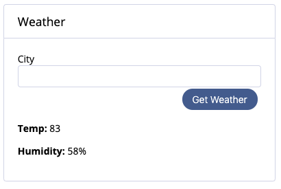

## Instructions:
- Given the story below, build a component that will satisfy the acceptance criteria below.
- You must have node.js installed (lts version should be fine) to complete this assignment.

## Story:
As a user, I want to get the current weather for a city, so I can plan my day accordingly.

## Acceptance Criteria:
- App will use Vue
- Entry .js should be written in `app/app.ts`
- Entry for .scss should be written in `app/styles/index.scss`
- App will use the Global Fetch API
	- Documentation can be found at https://developer.mozilla.org/en-US/docs/Web/API/Fetch_API/Using_Fetch
- Data will be fetched from the Open Weather API (endpoint and appid already supplied at top of app.ts)
	- API documentation found at http://openweathermap.org/current
- Component will be mounted in a `
` element (already provided in index.html)
- Component will take a city as input, and display the temperature and humidity
	- Temperature will be displayed in Fahrenheit
	- Humidity will be displayed as a percentage
- Component will be styled according to the provided mock-up below.

## Building and Watching
- This project uses Webpack. The following command should be all you need:
	- To install dependencies: `npm i`
	- To build the project: `npm run build`
	- To run the project: `npm run server`